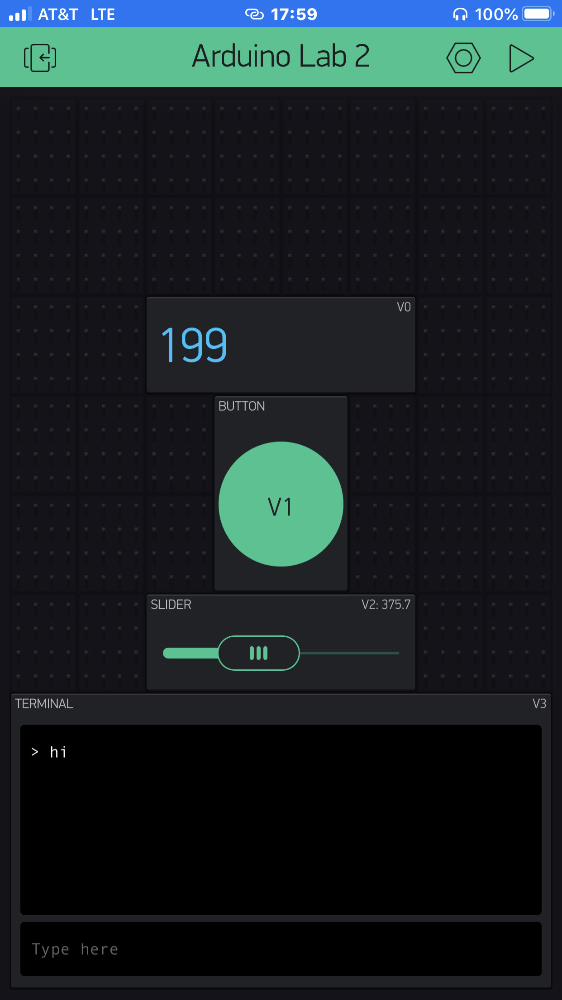

Name: Hayden Pietsch

EID: HSP528

Team Number: F14

## Questions

1. What is the purpose of an IP address?

    It gives an address to a machine to allow other machines to talk to it

2. What is a DNS? What are the benefits of using domain names instead of IP addresses?

    It allows one to "tag" a name to an ip address, makes it easier for a human to remember name over ip address

3. What is the difference between a static IP and a dynamic IP?

    Dynamic IP addresses are always changing while static IP addresses are always one address

4. What is the tradeoff between UDP and TCP protocols?

    TCP waits for connection to reciever before sending data whereas UDP sends data regardless of a connection

5. Why can't we use the delay function with Blynk?

   Blynk is event based, not time based

6. What does it mean for a function to be "Blocking"?

    It ties up the program, wasting time.

7. Why are interrupts useful for writing Non-Blocking code?

    allows one to exit code if a higher priotity task is being called. This allows for code to move upon user input, not having to wait for a delay to finish counting.

8. What is the difference between interface and implementation? Why is it important?

   Interface is what is setup and defeines how you call functions. implementation is how a person decideds to use the functions made during interface and use those functions for various things. 

9. Screenshot of your Blynk App:

    
